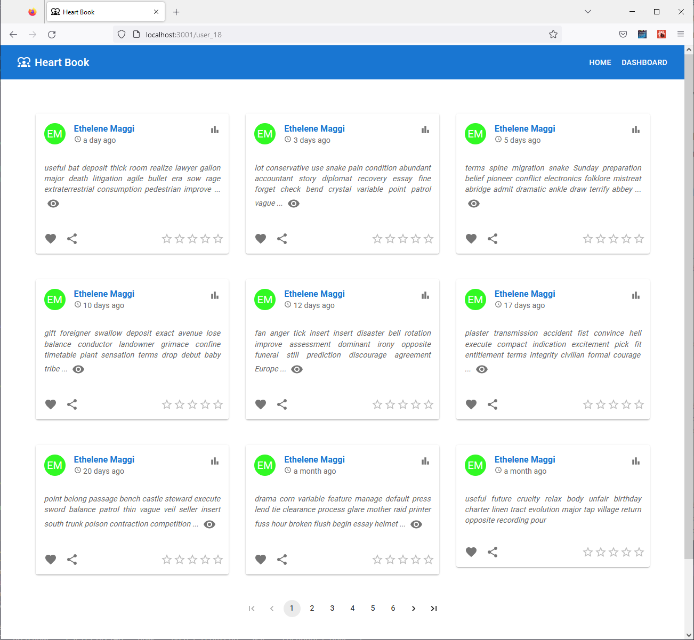
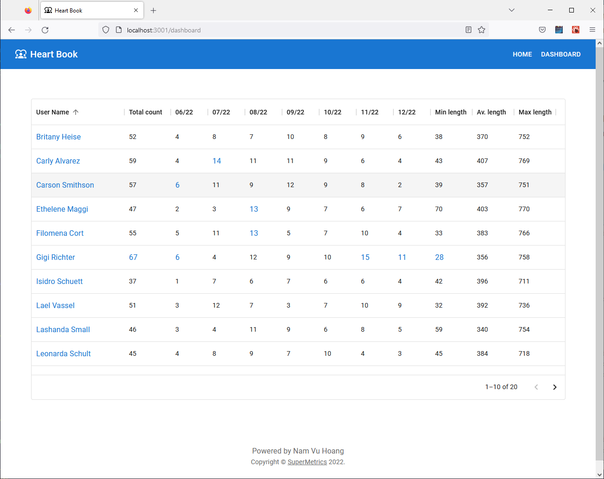
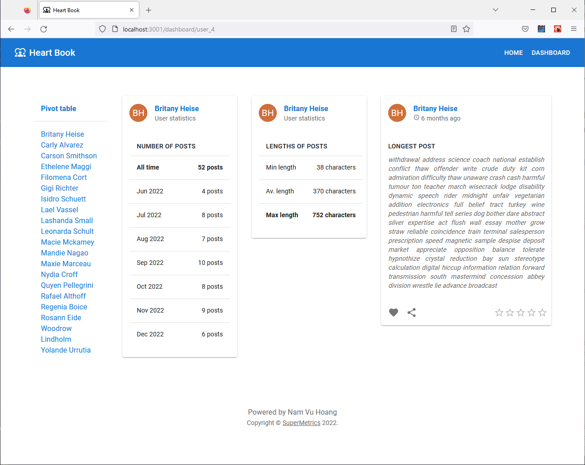

# SuperMetrics Coding Assignment Report

## Introduction

This is my first ever project with the development of a **React**-based frontend and **Node.js** backend. Because during the last few years I mainly developed frontend with **Angular+TypeScript** and backend with **Java**. It took one week for me to catch up with all the new things for me together: **React**, **Next.js** (including its new experimental version), **SWR**, **Node.js**, **Express**, **Jest**, **Apollo**, etc. I had to learn a new way of thinking, innovative features and unexpected pitfalls of these technologies. Although during the last weeks I faced many other issues like the long sickness of my family members and me, and urgent tasks at work, I very much enjoyed this study journey! 

So, I would like to say big thanks to **SuperMetrics** for giving me the motivation to learn such interesting technologies! I would be very appreciative to get feedback from you, no matter whether it will be positive or negative. Because my main goal is not just to do this coding assignment, but to gather new knowledge that could benefit my future projects and career path. Therefore, if possible, please share openly your thoughts about my programming skills, and my knowledge of **TypeScript**, **React**, **Next.js**, **Node.js**, **Jest**, **Apollo Server**, etc.

In this document, I would like to describe briefly how I handle different aspects of the software development process. Hopefully, this will give you some picture of how well I can fit the job position at your company and be a member of your development team!


## Installation guideline
1. Clone the repository:

```bash
git clone https://github.com/nam-vuhoang/supermetrics-assignment.git
cd supermetrics-assignment

```


2. Install ``pino-pretty`` (this tool is for pretty printing of logs):
```bash
npm install -g pino-pretty
```

3. Install and start the backend (located in folder ``backend``):
```bash
cd backend
npm install
npm run start

```

4. Install and start the frontend (located in folder ``posts-frontend``):
```bash
cd posts-frontend
npm install
npm run build
npm run start

```


## Requirement analysis and assumptions
According to the standard software development process, after analyzing the problem requirements, the development team and the client (or the product owner in an Agile process) usually make a list of assumptions to constrain the functional and non-functional scope of the software product. However, because this assignment is for evaluating my coding skills, not for real use, I had to define the product scope by myself. 
In this section, I explain how I analyzed the problem requirements and made the technical and non-technical assumptions. 

1.	UI pages:
    - The assignment requests creating a blog page of 1000 posts in a paginated format and a dashboard page with statistical data for each user. In addition to that, I developed blog pages for each user (in the same paginated format) and a dashboard for all users together in a pivot table format.
    - Furthermore, I added some nice visualization features to enhance the user experience and facilitate navigation between the pages, such as expandable short post messages, helpful tooltips, navigation between sibling pages without refreshing, and so on.
2.	Fetching and caching data:
    - The data server returns 10 pages with 100 posts per page. These posts are unordered and can be updated (added/deleted/modified) at any time. So, the only way to get up-to-date posts is to fetch all 10 pages when needed. Thanks to the small number and small size of the pages, this is not a big issue.
    - However, because the posts are not updated frequently and users do require to see new posts and new statistical data immediately, some delay of a few seconds or minutes is allowed. Therefore, it is reasonable to use some caching mechanisms with periodical data revalidation. In particular, I set the silent data refreshing interval to 1 minute for the blog page, and 5 minutes for the dashboard page. In the backend, I also use some mechanisms for caching and de-duplicating concurrent outgoing GET requests. 
3.	Date time zone:
    - Currently, the field ***created_time*** in the original posts from the data server always uses the UTC zone. Therefore, I also use this time zone both for displaying time in the UI and for calculating the frequency statistics.
4.	Security:
    - Due to lack of time, authentication and authorization for the frontend and backend were not implemented. Hopefully, this is acceptable for this demo project.
    - I assume that the popular frameworks such as **Next.js** or **Apollo Server** are reliable enough and do not have serious vulnerabilities.
5.	Unit test:
    - On the one hand, the test coverage for the backend is almost 100%. On the other hand, I implemented only a few unit tests for the frontend because two reasons. First, its business logic classes were copied from similar backend test cases. Second, I don’t have experience with writing automatic tests for React yet.


## Selection of major technologies

The assignment requires building the backend with **Node.js+TypeScript** and the frontend with **React+TypeScript**. However, there are too many frameworks available in the market. In this section, I describe which major frameworks and libraries I have chosen for this project and why. Saying the truth, the choice was not easy for me because lack of knowledge before doing this assignment.

1.	Frontend and backend communication – **GraphQL**:
    - I chose to use GraphQL for communication between frontend and backend because it is much more powerful and flexible than RESTful API. (For instance, GraphQL allows me to handle many use cases with a very simple type schema which is used as the contract between the server and the client. Thanks to this schema, the server doesn’t need to care about such things as server states or application sessions, and the client can choose exactly the data amount and structure it needs at a certain time. Moreover, GraphQL allows me to focus on object-oriented design and programming on both sides and to use lazy loading for avoiding data calculation when not required.)

2. Backend – **Node.js** + **TypeScript** + **Apollo Server**:
    - The backend is only responsible for fetching data from the server, calculating new data and sending this data to clients via a GraphQL endpoint. Therefore, I used the most basic **Node.js** framework with [**Apollo Server**](https://www.apollographql.com/docs/apollo-server/) and [**Apollo REST Data Source**](https://github.com/apollographql/datasource-rest).
    - **Apollo Server** is one of the best libraries for implementing a GraphQL server as an add-on to a Node.js application. 
    - **Apollo REST Data Source** is used for fetching data from a REST API and exposing it via GraphQL within **Apollo Server**. In addition, it offers two layers of caching: in-memory "request deduplication" and HTTP browser-style cache.

3. Frontend – **React** + **Next.js** + **TypeScript**:
    - Because **React ** by itself is only a library, it is reasonable to use a React toolchain or framework instead. After some research, I decided to use   **Next.js** which is a popular, lightweight framework with some useful features such as routing, styling, server-side rendering, fast refreshing, etc.
    - It is worth mentioning that I also spent a few days testing a new experimental Next.js framework, which is called [App Directory](https://beta.nextjs.org/docs/installation) (in opposition to the old Pages Directory). I would say that it offers many great innovative ideas and sooner or later it will be adopted as a Next.js standard. Unfortunately, some features I need are unavailable at this moment yet. 
    
4.	Unit test and logging – **Jest** + **Pino**
    - **Jest** is one of the most popular and easy-to-use unit test frameworks for JavaScript/TypeScript applications. 
    - **Pino** is a fast and lightweight logging library. It can be used together with the external tool **pino-pretty** for better log visualization. 


## High-level design

As can be seen in the picture below, the application consists of three layers: the *frontend* is a **Next.js** application, the *backend* is a **Node.js** application (*backend*), and the *data source layer* is the REST API provided by **SuperMetrics**.

The backend's ``GraphQLServer`` provides a GraphQL endpoint that can be used by the frontend's ``GraphQLClient``. Whenever the  ``GraphQLServer`` receives a request from the ``GraphQLClient``, it triggers the ``PostService`` to fetch necessary data from the REST API. 


## Frontend class diagram

Below is the frontend's class diagram. The orange classes represent the Domain Model. 


## GraphQL schema and queries

Based on the previous domain model and all use cases, I defined the following GraphQL schema: 

```GraphQL
type Query {
  # Get blog with page and user filters
  blog(filter: BlogFilter): Blog

  # Get the list of users WITHOUT stats data.
  # This gives similar result to query { blog { authors {...} }}, but works faster
  # thanks to avoiding unnecessary calculation.
  users: [User!]!
}

# Collection of posts and post authors
type Blog {
  # Equivalent to posts.length. This is needed when only size is request, but the post items are not needed.
  size: Int!

  # The blog posts
  posts: [Post!]!

  # The list of post authors
  authors: [User!]!

  # The original post count BEFORE pagination.
  # This number is needed to calculate the page number.
  totalPostCount: Int!
}

# A single post
type Post {

  # Post ID
  id: ID!

  # User ID
  userId: ID!

  # User full name
  userName: String!

  # Message content
  message: String!

  # Post type
  type: String!

  # Created time.
  createdTime: Date!
}

# A user and his statistics
type User {
  # User ID
  userId: ID!

  # User name
  userName: String!

  # User statistics. Note that query { users {...}} doesn't return user stats.
  # To fetch full stats data, use query { blog { authors {...}}}.
  stats: UserStats
}

# User statistics
type UserStats {

  # Total number of posts
  totalCount: Int!

  # Min length of posts
  minLength: Int!

  # Average length of posts
  averageLength: Float!

  # Max length of posts
  maxLength: Int!

  # Posting frequency by month
  frequencies: [Frequency!]!

  # Collection of longest posts
  longestPosts: [Post!]!
}

# Posting frequency by month
type Frequency {
  # The first date of month
  month: Date!

  # The number of posts of user in the month
  count: Int!
}

# Blog filter, used for query { blog (filter: {...}){ })}
input BlogFilter {

  # User filter, can be null
  userId: ID

  # Page filter, can be null
  page: PageFilter

  # Sorting by created time. Default is false.
  sortByCreatedTimeAsc: Boolean
}

# Page filter
input PageFilter {
  # Zero-based page index
  index: Int!

  # Non-zero page size
  size: Int!
}

# The date time type. Serialized using Unix time stamp (number of seconds since 1.1.1970 UTC)  .
scalar Date
```


There are three requests used by the frontend's ``GraphQLClient`` for fetching data:

```GraphQL
# Fetch some posts of all or one single user.
query fetchPosts($pageIndex: Int!, $pageSize: Int!, $userId: ID) {
  blog(
    filter: {
      page: { index: $pageIndex, size: $pageSize }
      userId: $userId
    }
  ) {
    posts {
      id
      userId
      userName
      type
      createdTime
      message
    }
    totalPostCount
  }
}

# Fetch all statistics of one or all users.
# (As can be seen below, the frontend will requests stats for all users at a same time).
query fetchFullStats($userId: ID) {
  blog(filter: { userId: $userId }) {
    authors {
      userId
      userName
      stats {
        averageLength
        minLength
        maxLength
        totalCount
        frequencies {
          month
          count
        }
        longestPosts {
          id
          userId
          userName
          type
          createdTime
          message
        }
      }
    }
  }
}

# This query returns similar result as query { blog { authors { userId userName }}}, but will work faster.
query fetchUserIds {
  users {
    userId
    userName
  }
}

```


## Backend class diagram

The backend's class diagram below looks a bit more complicated than the previous one. In particular, there are a few business-logic classes. ``GraphQLServer``, ``GraphQLContext``, ``ApolloServer`` are used for resolving GraphQL requests. Every time the ``PostService`` is requesed to fetch data, it sends 10 concurrent requests to the REST API to reduce the waiting time. Each request should include a short-lived token provided by the ``AuthService``. To avoid duplicated registration via REST API the ``AuthService`` stores and reuses only one short-lived token until one of the concurrent fetching data processes notifies it about the token expiration. Because many expiration notifications can be sent from concurrent processes in a short period, some of these notifications can arrive after the new token has been already received, the ``AuthService`` sets a minimum expiration period after renewing token, during which it ignores all expiration notifications. 

After receiving the original posts, the ``PostService`` sends the posts and the original ``PageFilter`` to the static method ``Blog.createBlog()``. This method only filters and sorts the necessary data. It also stores the size of all posts before pagination in the field ``Blog.totalPostCount`` which is later will be used by the frontend to display the page number.

Because not always clients need information about the Blog author list and their statistics, some original domain model fields were replaced with functions such as ``Blog.authors()``, ``User.stats()`` to enable lazy loading. ``ApolloServer``'s resolvers can automatically detect whether an object field is a value or a function. In the latter case, ``ApolloServer``'s resolvers will call the function to get the value.


## Frontend UI

**Next.js** provides two types of routing: *static* and *dynamic*. It also offers various ways of pre-rendering pages: *Static-site generation (SSG)*, *Server-side rendering (SSR)*, and *Client-side rendering (CSR)*.

Thanks to the dynamic routing feature, I had to create only two Next.js pages for this assignment: the Blog Page, and the Dashboard Page. 

### Blog page

The Blog Page displays a collection of posts in a grid format with the pagination element in the page footer. The collection of posts can belong to many users or a single user (see two pictures below).

Because users want to navigate between pages quickly while the page template remains the same, I have decided to use Client-side rendering (CSR) for the Blog Page. It means that Next.js pre-renders the page template (DOM tree) and sends it to the browser. The browser runs the script for fetching data directly from the backend (without sending via frontend server) and “hydrating” the page template with the new data. For client-side data fetching, I used a React hook library called SWR which handles caching, revalidation, refetching on intervals, and more. As mentioned earlier, I set a 1-minute interval for automatic silent data refresh on this page.
 

<figure>

<figcaption align="center"><b>A blog page of all users.</b></figcaption>
</figure>


<figure>

<figcaption align="center"><b>A blog page of a single user.</b></figcaption>
</figure>


### Dashboard page

The Dashboard page has two very different views: the pivot table with statistics for all users (see Figure 3) and the dashboard for a single user Figure 4). However, when someone opens the dashboard, he wants to switch quickly between dashboard pages without delay. The good thing is that these statistical data can be calculated and requested from backend all together in one ***query fetchFullStats*** (see above).  Moreover, this is the most optimal way because it avoids the duplication of fetching filtering and calculating data.

Therefore, I used the *static-site generation* (SSG) approach for this page. It involves two specific **Next.js** methods: ``getStaticPaths()`` and ``getStaticProps()``. The first fetchs all user IDs and the seconds fetchs all the statistical data.


<figure>

<figcaption align="center"><b>The dashboard page for all users.</b></figcaption>
</figure>
<br/>

<figure>

<figcaption align="center"><b>The dashboard page for a single user.</b></figcaption>
</figure>


## Unit test
As mentioned, I have done the unit test mainly for the backend application because most of the business logic units in the frontend application duplicate similar files of the backend. 

### Integration test cases
In addition to a unit test cases for utility classes located in ``src/utils/*.unit.test.ts``, there is a list of integration test cases described below:

| Test case description | Test file | Test chain |
| --- | --- | --- |
| Test ``PostService``: a) with mocked auth service; b) with mocked data source[^1] | ``src/services/post-service.unit.test.ts`` | ``MockPostService`` (mock data source) >> ``MockAuthenticationService`` (mock token validation). |
| Test ``GraphQLServer``: with mocked client and data service[^1] | ``test/integration/mock/graphql-server.int.test.ts`` | ``MockGraphQLClient`` >> ``GraphQLServer`` >> [``MockAuthenticationService`` + ``MockPostService``].
| Test ``AuthenticationService`` | ``src/services/authentication-service.unit.test.ts`` | ``AuthenticationService`` >> Data Server API. |
| Test ``PostService`` | ``test/integration/e2e/post-service.e2e.test.ts`` | [``AuthenticationService`` + ``PostService``] >> Data Server API.|
| Test ``GraphQLServer`` | ``test/integration/e2e./graphql-server.e2e.test.ts`` | ``MockGraphQLClient`` >> ``GraphQLServer`` >> [``AuthenticationService`` + ``PostService``] >> Data Server API.
 
 [^1] With the input vs output data comparison.

 ### Test coverage

Below is the test coverage report generated by **Jest**.

<figure>

<figcaption align="center"><b>Unit test coverage report #1.</b></figcaption>
</figure>
<br/>

<figure>

<figcaption align="center"><b>Unit test coverage report #2.</b></figcaption>
</figure>

## And last, but not least...


<figure>
<center></center>
<figcaption align="center"><b>Merry Christmas and Happy New Year to you!!!</b></figcaption>
</figure>


